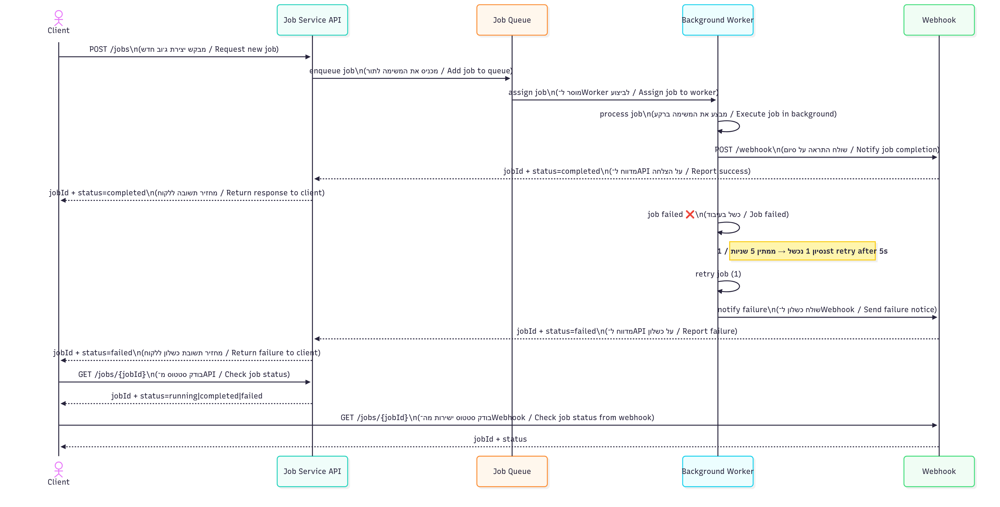

# 🚗 Resource Allocator (Parking-Lot Preset)

A small system for allocating parking spots to vehicles using **first-fit** policy.  
Built with **TypeScript + Express**.

---

## 📐 Design & Implementation
- **Allocator class** manages resources (vehicles) across **Floors → Spots**.  
- Encapsulation: Floors/Spots are private (not exposed externally).  
- Deterministic allocation → *first compatible floor wins*.  
- Strict typing: TypeScript `union types + interfaces`.

### Vehicle & Spot Types
| Vehicle      | Allowed Spots        |
|--------------|----------------------|
| 🏍️ Motorcycle | Motorcycle / Compact / Large |
| 🚗 Car        | Compact / Large      |
| 🚐 Van        | Large only           |

---

## 🖼️ System Diagram



---

## 🌐 API Endpoints

| Method | Endpoint      | Body Example                   | Response                |
|--------|--------------|--------------------------------|-------------------------|
| POST   | `/allocate`  | `{ "id": "car1", "kind": "CAR" }` | `location` / `no_capacity` |
| POST   | `/release`   | `{ "id": "car1" }`             | `ok` / `not_found`      |
| GET    | `/stats`     | –                              | `{ totalBySize, freeBySize, usedByKind }` |
| GET    | `/isFull`    | –                              | `true` / `false`        |
| GET    | `/isEmpty`   | –                              | `true` / `false`        |

---

## 📂 Project Structure
```text
.
├── src
│   ├── allocator.ts     # Core Allocator logic
│   ├── types.ts         # Enums & interfaces
│   ├── server.ts        # Express server + routes
│   └── index.ts         # Entry point
├── package.json
├── tsconfig.json
└── README.md
```

---

## ▶️ How to Run

1. Install dependencies:

   ```bash
   npm install
   ```
2. Build:

   ```bash
   npm run build
   ```
3. Start:

   ```bash
   npm start
   ```
4. Test with curl / Postman (examples below).

---

## 🧪 Example curl Tests

```bash
# Allocate a Car
curl -X POST http://localhost:3000/allocate \
  -H "Content-Type: application/json" \
  -d '{"id":"car1","kind":"CAR"}'

# Release a Car
curl -X POST http://localhost:3000/release \
  -H "Content-Type: application/json" \
  -d '{"id":"car1"}'

# Get Stats
curl http://localhost:3000/stats

# Check if Full
curl http://localhost:3000/isFull
```

---

## 🎯 Design Highlights

* **Encapsulation** → Floors/Spots hidden internally.
* **Type-safety** → strict TypeScript + union types.
* **Deterministic allocation** → first-fit policy.
* **Resource registry** → keeps `resourceId → kind`.
